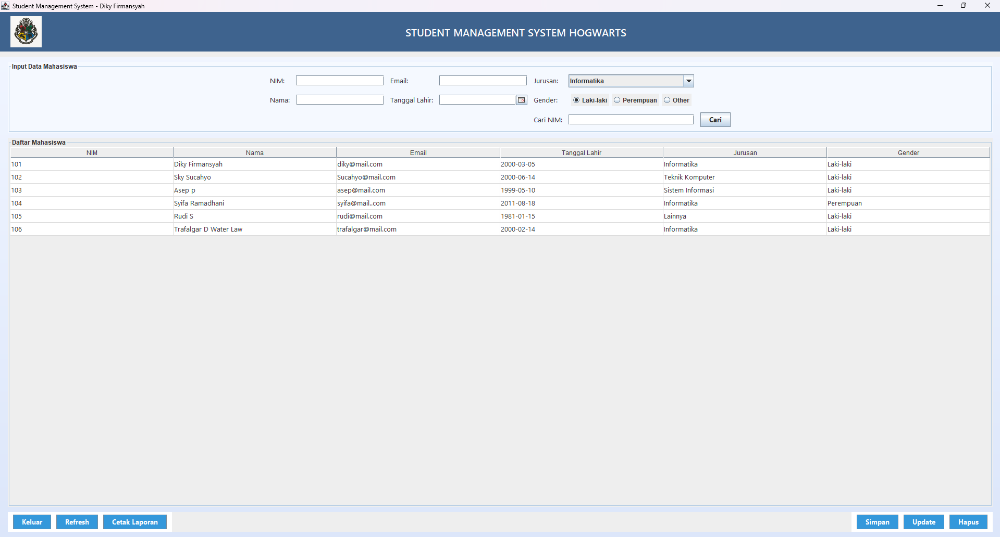
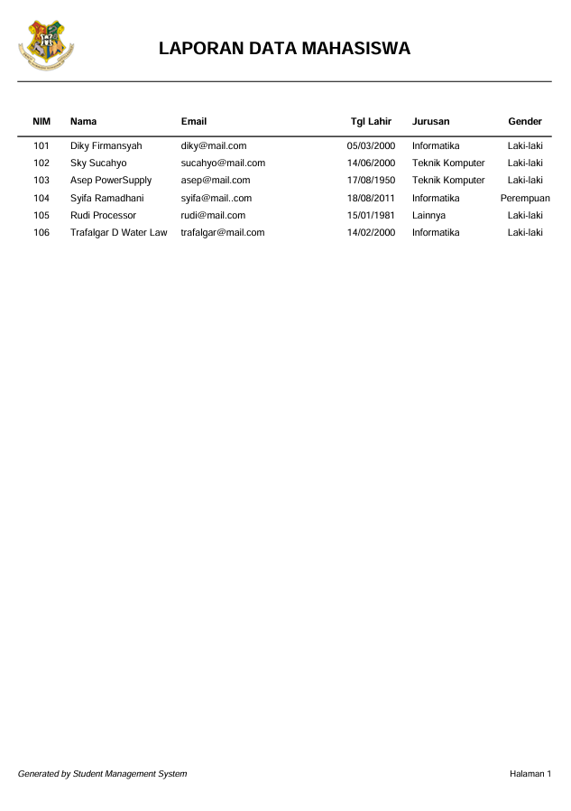

# 🎓 Student Management System – Hogwarts Edition


> A modern **Student Management System** built using **Java Swing**, **MySQL**, and **JasperReports**.  
> Developed as a final project for the **Object-Oriented Programming (PBO)** course.

---

## 👨‍💻 Developer Information
**Name:** Diky Firmansyah  
**NIM:** 2311510206  
**Program Study:** Teknik Informatika – Universitas Budi Luhur  
**Lecturer:** Mr.Rizky Tahara  
**Semester:** 5  

---

## 🧠 Description
This project is a **desktop-based student data management system** that implements CRUD (Create, Read, Update, Delete) functionality and **automated report generation in PDF** using JasperReports.  
The application allows users to:
- Manage student data (add, edit, delete, search)
- Display data in a table
- Generate and export a report in PDF format with logo and page numbering
- Use color themes and header logos for better UI presentation

---

## ⚙️ Main Features
✅ Add new student data  
✅ Edit existing data  
✅ Delete selected data  
✅ Search students by NIM  
✅ Generate PDF reports (with custom range of NIM)  
✅ Automatic screenshots stored in `/captures/` folder  
✅ Elegant and responsive Swing UI  

---

## 🗂️ Folder Structure
```
StudentManagementSystem/
│
├── captures/               # Screenshots for each CRUD operation
│   ├── create.png
│   ├── read.png
│   ├── update1.png
│   ├── update2.png
│   ├── delete1.png
│   ├── delete2.png
│   ├── report1.png
│   ├── report2.png
│   ├── report3.png
│   ├── report_final.png
│
├── lib/                    # External JAR libraries
│   ├── mysql-connector-j-9.4.0.jar
│   ├── jasperreports-6.21.5.jar
│   ├── jasperreports-fonts-6.21.5.jar
│   ├── jasperreports-javaflow-6.21.5.jar
│   ├── commons-beanutils-1.9.4.jar
│   ├── commons-collections-4.4.jar
│   ├── commons-digester-2.1.jar
│   ├── commons-logging-1.2.jar
│   ├── jcalendar-1.4.jar
│   └── itextpdf-5.5.13.2.jar (optional)
│
├── src/
│   ├── studentapp/
│   │   ├── dao/           # Data access logic
│   │   │   └── StudentDAO.java
│   │   ├── model/         # Entity model
│   │   │   └── Student.java
│   │   ├── reports/       # JasperReport template & logo
│   │   │   ├── student_report.jrxml
│   │   │   ├── student_report.jasper
│   │   │   ├── logoCRUD.png
│   │   │   ├── logo1.png
│   │   │   ├── logo2.png
│   │   │   ├── logo3.png
│   │   │   └── logo4.jpg
│   │   ├── ui/            # Main JFrame (UI)
│   │   │   └── MainFrame.java
│   │   ├── util/          # Utilities (connection, report)
│   │   │   ├── DatabaseConnector.java
│   │   │   └── ReportGenerator.java
│   │   └── Main.java
│   ├── student_db.sql     # Database export file
│   └── student_report.pdf # Example output report
│
├── .gitignore
├── README.md
└── StudentManagementSystem.iml
```

---

## 🧩 Libraries Used
| Library | Description |
|----------|-------------|
| **mysql-connector-j-9.4.0.jar** | Connects Java to MySQL database |
| **jasperreports-6.21.5.jar** | Core JasperReport engine |
| **jasperreports-fonts-6.21.5.jar** | Font support for reports |
| **jasperreports-javaflow-6.21.5.jar** | Report compilation helper |
| **commons-beanutils-1.9.4.jar** | Data binding utility for JasperReports |
| **commons-collections-4.4.jar** | Used by JasperReports internally |
| **commons-digester-2.1.jar** | XML parsing for JasperReports |
| **commons-logging-1.2.jar** | Logging dependency |
| **jcalendar-1.4.jar** | Date picker component |
| **itextpdf-5.5.13.2.jar** | (Optional) PDF rendering library |

---

## 💾 Database Structure
**Database name:** `student_db`  
**Table name:** `students`

```sql
CREATE TABLE students (
  student_id INT(11) NOT NULL PRIMARY KEY,
  name VARCHAR(100),
  email VARCHAR(100),
  birth_date DATE,
  major VARCHAR(50),
  gender VARCHAR(20)
);

INSERT INTO students (student_id, name, email, birth_date, major, gender) VALUES
(101, 'Diky Firmansyah', 'diky@mail.com', '2000-03-05', 'Informatika', 'Laki-laki'),
(102, 'Sky Suchayo', 'suchayo@mail.com', '2000-06-14', 'Teknik Komputer', 'Laki-laki'),
(103, 'Asep PowerSupply', 'asep@mail.com', '1999-05-10', 'Teknik Komputer', 'Laki-laki'),
(104, 'Syifa Ramadhani', 'syifa@mail.com', '2011-08-18', 'Informatika', 'Perempuan'),
(105, 'Rudi Processor', 'rudi@mail.com', '1981-01-15', 'Lainnya', 'Laki-laki');
```

---

## 🎨 User Interface Preview
| Main Form | Report PDF |
|------------|-------------|
|  |  |

---

## 🧾 How to Run
1. Open the project in **IntelliJ IDEA**  
2. Go to `File → Project Structure → Modules → Dependencies`  
   → Add all `.jar` files from `/lib/` folder  
3. Import `student_db.sql` into your **MySQL database**  
4. Run `Main.java`  
5. The GUI window will appear  
6. Test all CRUD functions and generate PDF report

---

## 🧠 Technologies Used
- **Java Swing** – User Interface  
- **MySQL** – Database  
- **JasperReports** – Report generation  
- **JCalendar** – Date picker  
- **IntelliJ IDEA** – IDE

---

## 🧾 Example Workflow
| Action | Description |
|--------|--------------|
| 🟢 **Create** | Add new student via input form |
| 🔵 **Read** | Display data in table |
| 🟠 **Update** | Edit selected student record |
| 🔴 **Delete** | Delete student after confirmation popup |
| 🟣 **Report** | Export data range to PDF |

---

## 📤 How to Export Database (SQLyog)
1. Open SQLyog → Right-click `student_db` → *Backup / Export → SQL Dump*
2. Select **Structure and Data**
3. Check “Include CREATE DATABASE statement”
4. Save as: `student_db.sql`

---

## 🏁 Final Notes
✅ CRUD + JasperReport fully working  
✅ Folder captures filled with screenshots  
✅ Database connected successfully  
✅ All dependencies properly linked  
✅ Professional folder structure

---

## 📚 License
This project is licensed under the [MIT License](https://opensource.org/licenses/MIT).  
Feel free to modify and reuse for educational purposes.

---

## 💬 Contact
📧 **Email:** firmansyahdiky06@mail.com   
🔗 **GitHub:** [github.com/TrafalgarDiky](https://github.com/dikyfirmansyah)  
🏫 **Universitas Budi Luhur**, Jakarta – Indonesia
